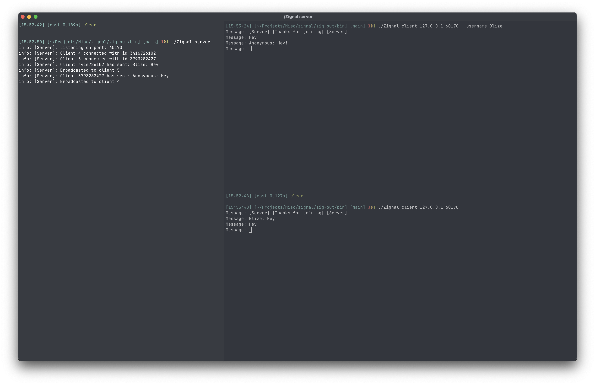

<div align="center">

# ⚡ zignal

**A lightweight, fast terminal chat application written in Zig**

[](https://ziglang.org/)
[](LICENSE)
[](https://github.com/Blize/zignal)

*For those moments when you need quick, hassle-free communication*



</div>

---

## ✨ Features

- 🍎 **macOS & Linux** — Full support for Unix-like systems
- 💬 **Modern TUI** — Beautiful terminal interface powered by [libvaxis](https://github.com/rockorager/libvaxis)
- 🔌 **Simple Networking** — Connect to anyone instantly
- ⌨️ **Intuitive Controls** — Easy scrolling, filtering, and navigation
- 🪶 **Lightweight** — Single binary, minimal footprint

---

## 📦 Installation

### Prerequisites

- [Zig](https://ziglang.org/download/) **0.15.2**
- macOS or Linux (Windows not supported)

### Dependencies

- [libvaxis](https://github.com/rockorager/libvaxis) — Modern TUI library *(fetched automatically)*

### Build from Source

```bash
# Clone the repository
git clone https://github.com/Blize/zignal.git

# Build the application
cd zignal && zig build

# The binary is ready at zig-out/bin/zignal
```

---

## 🚀 Usage

### Starting a Server

Host a chat room for others to join:

```bash
./zignal server
```

#### Server Options

| Option | Description |
|--------|-------------|
| `-p, --port <port>` | Set the server port (default: 8080, use 0 for any available) |
| `-s, --size <size>` | Set max number of clients (1-4095, default: 4095) |

```bash
# Start with default settings (port 8080, max 4095 clients)
./zignal server

# Start on a custom port
./zignal server -p 9000
./zignal server --port 9000

# Start with limited clients
./zignal server -s 100
./zignal server --size 100

# Combine options
./zignal server -p 9000 -s 50
./zignal server --port 0 --size 100  # Port 0 assigns any available port
```

Share your IP address and port with others on your network so they can connect!

### Joining as a Client

```bash
./zignal client <IP> <PORT>
```

#### Client Options

| Option | Description |
|--------|-------------|
| `-u, --username <username>` | Set your username to see in the chat (default: Anonymous) |

```bash
# With a custom username
./zignal client <IP> <PORT> -u <username>
./zignal client <IP> <PORT> --username <username>

./zignal client -u <username> <IP> <PORT>
./zignal client --username <username> <IP> <PORT>
```

### Examples

```bash
# Start a server with defaults
./zignal server

# Start a server on port 9000 with max 50 clients
./zignal server -p 9000 -s 50

# Connect to localhost
./zignal client 127.0.0.1 8080

# Connect with a username
./zignal client -u Alice 192.168.1.100 8080
./zignal client --username Bob 192.168.1.100 8080
```

### Help

```bash
./zignal -h
```

---

## 🎮 Controls & Commands

### Client Features

- 📜 Scrollable chat history
- 🎮 Custom commands

### Client Commands

| Command   | Description                |
|-----------|----------------------------|
| `/exit`   | Exit the application       |
| `/clear`  | Clear the message history  |
| `/help`   | Show available commands    |

### Server Features

- 📊 Connected users display
- 🔍 Log filtering via input bar
- 📜 Scrollable log history

---

## 🛣️ Roadmap

- [ ] 🔐 End-to-end encryption
- [ ] 💬 Multiple chat rooms
- [ ] 📨 Direct messaging (DMs)
- [ ] 🎨 Customizable themes
- [ ] 📁 File sharing

---

## 🤝 Contributing

Contributions are welcome! Feel free to open issues or submit pull requests.

---

## 📄 License

This project is licensed under the **GNU Affero General Public License v3.0** — see the [LICENSE](LICENSE) file for details.

